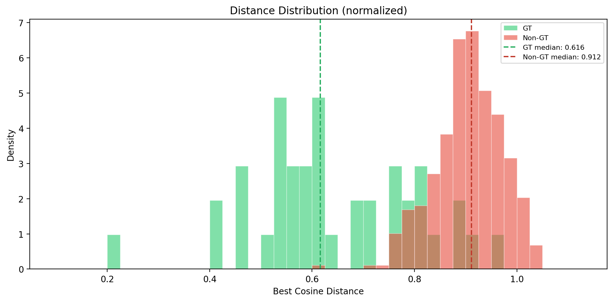
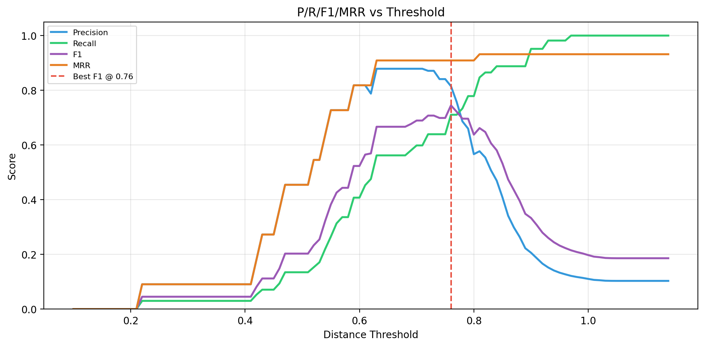
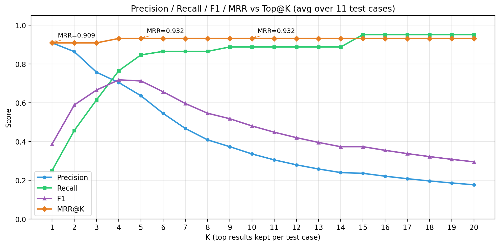

# Evaluating Retrieval for a Code Review RAG System

This is the second post documenting my journey building a Code Review Mentat. Last time I talked about _building_ the memory system. This time: how do you know if it actually works?

Initially, this post was meant to be about prompt engineering and upgrading your prompts. But when I started evaluating them, it turned out that the topic itself is a rabbit hole. So here I am, not describing any prompt engineering techniques—you can find those in [Anthropic's guide](https://docs.anthropic.com/en/docs/build-with-claude/prompt-engineering/overview). Instead, I want to document the foundation I built for evaluating my RAG system, so I can measure whether prompt changes actually help.

## The RAG Problem

What I'm building is a RAG system: retrieve relevant past comments, use them as context for generating new reviews. Like any RAG system, it lives or dies by retrieval quality. Retrieve irrelevant memories and you pollute the agent's context. Miss relevant ones and you've wasted the whole memory system. Evaluation isn't optional—it's the foundation.

## Two Prompts, One Goal

The system has two critical prompts:

1. **Storage prompt**: Generates a retrieval-optimized description of the situation where a given comment's knowledge should help.
2. **Retrieval prompt**: Generates queries to find those stored descriptions.

Both need to match my retrieval approach. If I'm using full-text search, they should emphasize keywords. If I'm using vector embeddings, they should focus on semantic content. Mismatch any part of this triangle, and retrieval fails.

## Choosing a Retrieval Method

I experimented with two approaches. Full-text search (FTS) was the obvious baseline—SQLite's FTS5 handles keyword matching with no extra infrastructure needed. The problem is that it requires keyword overlap between storage and retrieval prompts, and when both outputs are AI-generated from different contexts, getting consistent keywords is nearly impossible.

Vector embeddings solved this by capturing semantic meaning instead of exact words. Both stored descriptions and queries get converted to high-dimensional vectors, then retrieved by cosine similarity. "Car accident" and "vehicle collision" might share no keywords, but their embeddings are close. For embeddings, I used `mxbai-embed-large`, which is easily available through Ollama. It produces 1024-dimensional vectors and uses the same encoding method for queries and documents, which simplifies the setup. Thanks to my evaluation framework, I'll be able to test whether changing models helps, but this seemed like a reasonable first choice.

I'll skip the detailed FTS results—spoiler: 10% max recall, basically useless. I probably could squeeze more from it, but I wanted to jump to the interesting stuff. The rest of this post focuses on vector search evaluation.

## Creating Synthetic Ground Truth

The challenge is that there's no naturally occurring ground truth for code review relevance. Even if two pull requests modify the same code, comments from the first review might not be suitable for the new changes. It's highly contextual, and two exactly identical situations won't happen often, making it hard to find ground truth—something that should definitely be returned. I needed _something_ to measure against, so I built synthetic ground truth that's admittedly artificial but good enough for initial validation.

**Step 1: Collect real data**

I ran my tool on several pull requests and cherry-picked comments that were actually helpful—the kind I'd want to see again. This gave me 11 reviews with 41 comments total.

**Step 2: Simulate the storage pipeline**

I took the cached data from Step 1 (JIRA context, Confluence docs, code diffs) and ran it through my storage prompts. Generated embeddings, stored everything in SQLite—exactly like the production app would.

**Step 3: Run retrieval experiments**

For those same 11 reviews, I pretended the tool was seeing them for the first time. The retrieval prompt got the same limited context it would have in production: JIRA/Confluence context and the code diff. For each review, the LLM generated however many queries it thought would retrieve meaningful "memories" using the retrieval prompt. I used Claude 4.5 Sonnet for this.

Then I measured: which stored comments got retrieved?

**The ground truth assumption**

If a PR originally needed a specific comment, then "reviewing" that same PR again should retrieve that comment. It's circular logic, but it establishes a baseline. If the system can't retrieve comments for situations it's already seen, it definitely won't work for new situations.

**Target metric:** Optimize for the best balance between precision and recall.

**The limitations**

This ground truth is far from perfect. In production, the agent will never see the exact same code twice. The real test is retrieving useful comments for _similar_ situations in _different_ PRs. Also, amount of pull request is on the small end, 41 comments across 11 test cases is not much, but for now it should do.

But here's what it validates: if there's meaningful separation between ground-truth comments and random ones, the core mechanism works. The prompts are producing output that the retrieval method can distinguish. If I can't get separation in this easy case, there's no point testing production scenarios. If I _can_, I've validated the foundation.

## Metrics That Matter

Now that I have repeatable test cases, I need a way to compare results. The most common retrieval metrics are:

- **Precision**: How many returned results are actually relevant? (10 results, 5 relevant = 50% precision)
- **Recall**: What fraction of all relevant results did you retrieve? (5 retrieved out of 10 total = 50% recall)
- **F1 Score**: Harmonic mean of precision and recall—balances both
- **MRR (Mean Reciprocal Rank)**: Position of the first relevant result (position 1 = 1.0, position 2 = 0.5, position 3 = 0.33)

I measured whole test cases, not individual queries. One test case generated a variable number of queries—whatever the model decided. I combined results and deduplicated them, keeping only the best-ranked occurrence by cosine distance. 
*Example:* One test case might run 10 queries, dynamically created during the test as described above. Across those queries, the same memory can be returned multiple times; I keep only the first occurrence with the lowest distance, which matches how production will work.

## Finding the Separation

First question: are ground-truth (gt) and non-ground-truth (non-gt) results actually separated? Is the median of their cosine distances different?

Here's the tricky part. Each test has about 4–5 gt results but ~35 non-gt results, from a database of only 41 total memories. This happens because each test case has unique gt records, but non-gt records overlap across tests. I set a retrieval limit of 20 results per query, and each test runs about 10 queries—some could theoretically return the entire database. I used density-normalized histograms to handle this imbalance. Instead of comparing raw counts, I compared densities and marked the median for each group.

The distributions do overlap—as expected—but there's about 0.3 distance between their medians.

Given that all embedded strings describe code (and are therefore semantically similar to begin with), this separation is meaningful. Cosine distance normally ranges from 0 (semantically identical) to 2 (semantically opposite). Here we can see that max values reach about 1.2, but gt results cluster closer to 0 than non-gt results. Since all bins in this histogram have equal width, we can clearly see that gt memories are more likely to have lower cosine distance to the query than non-gt memories. That's what I needed to know.

## Finding the Threshold Sweet Spot

Next: which cosine distance threshold works best?

For this analysis, I calculated all the previously described metrics for results below each threshold value. I swept from a minimum of 0.1 up to 1.15 in increments of 0.025, giving me a dense set of data points to identify where F1 peaks—the metric that balances precision and recall, which is what I'm optimizing for.

_Side note_: I won't paste the Python code. Any LLM can generate this—it's just comparisons and arithmetic.

Below are the key metrics plotted as arithmetic mean values across all test cases for each threshold. Arithmetic mean is fairly naive, but in my case the test cases have very similar numbers of gt and non-gt records, so weighting isn't necessary. To clarify the aggregation: if at threshold 0.2 only one test returned results (with precision 1.0 and MRR 1.0) while the remaining nine tests returned nothing (contributing zeros), I simply averaged them, placing 0.1 as the precision for that threshold.

The plot splits into zones:

- **0.2–0.4**: Almost no results. Dead zone.
- **0.4–0.6**: Rapid growth. MRR and precision climb together—top results are consistently gt. Recall increases.
- **0.6–0.8**: Precision peaks around 0.7. MRR is near its maximum. At 0.76, F1 is optimal at 0.71. Further recall increases don't help because precision drops.
- **0.8+**: Way too loose.

Given that my ground truth is synthetic, I might want to be slightly less restrictive in production. For now, I will restrict results to be below 0.8 cosine distance. This should remove the worst noise while still including anything reasonably similar. If there are too many results, I'll cap them as well—this is a topic for another post, but for now I'll likely pick an arbitrary but reasonable limit, probably around 5.

## Top@k Analysis

I also calculated metrics for top@k results. I treated this as supplementary research alongside the threshold analysis. We should observe certain expected patterns if the system is behaving correctly.

Instead of filtering by distance threshold, I kept only the first k results (k = 1 to 20). This plot looks different from the threshold sweep—there's no "dead zone" because I'm working only with retrieved records. However, I don't know the actual distance of the kth result. This analysis simply verifies that the retrieval system behaves as expected.

We expect very high precision for k=1–2 (only gt in top results) with recall growing as we include more. If recall doesn't grow with k, the results are essentially random.

## What I Learned

Starting with synthetic ground truth isn't ideal, but it validates that the plumbing works. The separation between gt and non-gt results tells me the prompts and retrieval method are compatible.

Now I can test harder cases—retrieving for similar but not identical code.

## What's Next

I haven't even compared two different prompts to show this evaluation framework in action—I'll save that for another post.

If you're building RAG systems and struggling with evaluation, hopefully this helps. The code and full results will be on GitHub once I clean it up.
