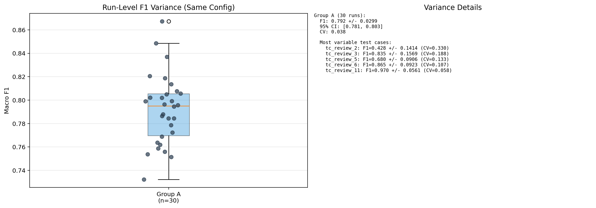
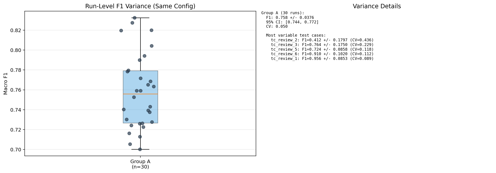
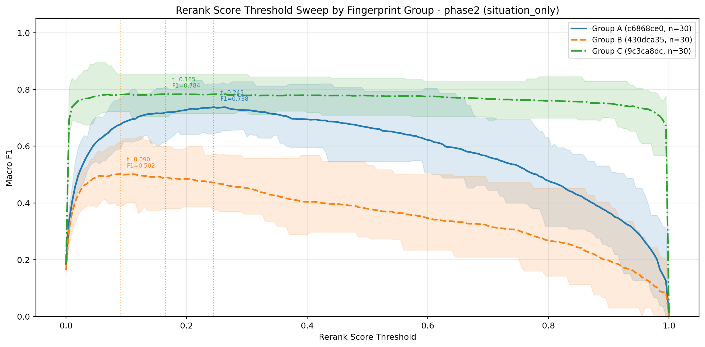
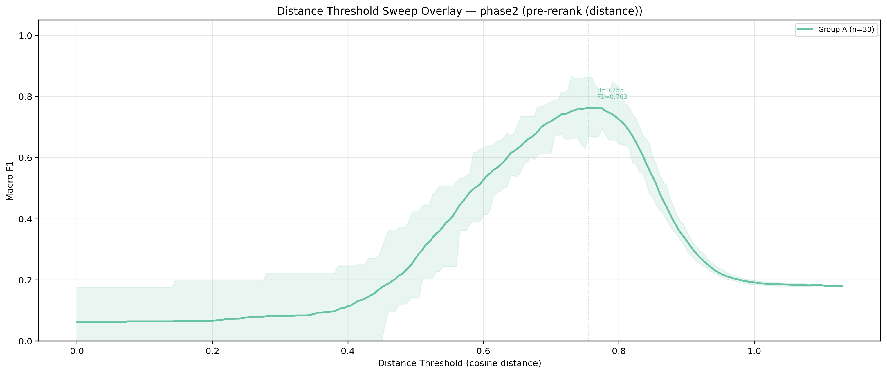

# Comparing results of non-deterministic retrieval

This is the third post in my RAG research series. Each one goes a bit deeper — last time I covered how to measure precision, recall, and F1 across test cases, and how to build ground truth when production gives you nothing: no expected results, no existing examples good enough to treat as a baseline.

This time the problem is different. My whole system is non-deterministic by design — the stored documents are LLM-generated, and so are the retrieval queries. Run the same test suite twice and you get different documents, different queries, and potentially different amounts of ground truth retrieved. Single-run metrics don't mean much here.

In this post I'll walk through how I approached this with repeated runs and statistical aggregation.

## What questions do I want to answer?

I wanted to know if using a reranker helps. And I wanted to know if changing the embedder or reranker affects results in any way. Ultimately, I want to know if implementing a different embedder is worth my time and whether it has a chance to improve user experience. A statistically significant improvement might still be too small to matter for the end user — and that distinction ends up driving my final decision.

## Where to start?

First, I needed to know the variance of my F1. In the last post I established it as my north star metric, and that holds for this evaluation too.

I had no variance data yet, so I had to start by running enough test suites to measure it.

A quick note on the tools I tested. For embeddings, I used mxbai-embed-large (through Ollama) as my baseline and tried snowflake-arctic-embed as an alternative. For reranking, I tested bge-reranker-v2-m3 (BGE from here on) and Qwen3-Reranker-0.6B (Qwen3). Retrieval queries were generated by Claude Sonnet 4.5.

One test case is one code review: code, additional business context, and the review comments that get transformed into memories — the documents I want to retrieve. I have 11 such test cases, and together they make up one test suite, or one run. From each run I macro-average my metrics, most notably F1.

But which F1? I ran a threshold sweep for each run — calculating F1 at every cosine distance threshold — and picked the best one. That gives me 30 "best F1" values, one per run. But each run picks its own optimal threshold, which is something I can't do in production — I need one fixed threshold that works across all runs.

So I took a second pass: I treated all 30 runs together and picked a single global threshold that gives the best average F1 across all of them. This is the number I'll report throughout this post. It's lower than the per-run optima, but it's the value I'd actually deploy.

I ran 30 test suites with the same configuration and prompts — the only thing changing between runs was LLM outputs. This way I could measure how LLM non-determinism affects an otherwise deterministic system, since embedding and reranking are deterministic.

## What results did I get?

First, let's look at the F1 variance before reranking. This tells me how stable the system is on its own.

A couple of outliers (one run hit 0.865), but most sit between 0.76 and 0.82. Pretty stable for a system where every run generates different LLM outputs.

Now the same after reranking with BGE.

The variance is slightly larger post-rerank. Reranking is destabilizing the results.

Here are the mean F1 values using the fixed global threshold:

| Config                              | Mean F1 |
| ----------------------------------- | ------- |
| Vector search (mxbai, no reranking) | 0.763   |
| + BGE reranker                      | 0.738   |

Reranking dropped F1. Not what I expected. But how do I know this isn't just noise from LLM non-determinism?

## Do my results actually mean something?

I ran a paired t-test on the 30 F1 scores (vector-only vs. BGE-reranked, same run). The 95% confidence interval for the mean difference was [−0.046, −0.005]. It doesn't include zero, which means the degradation is statistically significant. In 19 out of 30 runs, the reranker made things worse. Only 11 showed improvement. Cohen's d was −0.46, a small-to-medium effect size — but a consistent one.

## Looking for a way to improve

So I have some confidence that the difference isn't noise — BGE-reranked results are genuinely worse. The next question: does changing the embedder or reranker help?

I decided to check the snowflake embedder and the Qwen3 reranker.

I won't share detailed results for snowflake — it was bad. Its cosine distances clustered in a tiny range (1.38–1.43), leaving almost no room to separate relevant results from irrelevant ones. It doesn't seem suited for this kind of text.

The Qwen3 reranker actually increased my F1. I reused the same queries and documents from the 30 runs I'd already generated — so only the reranker was swapped, keeping the comparison fair.

| Config                              | Mean F1 |
| ----------------------------------- | ------- |
| Vector search (mxbai, no reranking) | 0.763   |
| + BGE reranker                      | 0.738   |
| + Qwen3 reranker                    | 0.784   |

At the global threshold, Qwen3 gives a 2.7% improvement over plain vector search. A paired t-test confirms this is statistically significant — the 95% CI is [+0.002, +0.039], Cohen's d = +0.41. But that lower bound (+0.002) is barely above zero. The test says "real effect," but just barely.

Compared to BGE, Qwen3 won 25 out of 30 runs. That difference is clear. But the improvement over no reranking at all is less than I expected.

The threshold sweep charts shows this from different perspective. The cosine distance curve peaks sharply around 0.755 and drops off if you move more than ~0.05 in either direction. It's sensitive, but the peak is obvious — you look at the chart and know where to set your threshold. The reranker curves are a different shape. Qwen3 has a wide plateau from about 0.1 to 0.4 where F1 barely changes. BGE plateaus too, but its best F1 never reaches the vector search baseline. The snowflake embedder configuration (group B) peaks at 0.50 and has massive variance.

Below are the threshold sweeps side by side. On the left: reranked results, where group A is BGE with mxbai embeddings, group B swaps in the snowflake embedder (still using BGE for reranking), and group C uses the Qwen3 reranker. On the right: pre-reranking results using cosine distance with mxbai.

   

Looking at these two charts, the shapes tell me something beyond raw F1 numbers. The cosine distance curve has a narrow peak — move 0.05 in either direction and F1 drops noticeably. With only 11 test cases and 30 runs, I'm not fully confident that 0.755 is the right threshold for production. New, harder test cases could shift that peak, and a narrow peak means there's not much room to be wrong.
The reranker curves are more forgiving. Reranking spreads the scores out — the gap between ground truth and non-ground-truth results is wider than what cosine distance gives you. That's what creates the plateau. You can pick a less restrictive threshold without much penalty, which could accommodate hard cases I haven't seen yet.
That almost convinced me to go with Qwen3. On paper, F1 barely improves — but the wider safe zone felt like a real practical advantage. A system where "close enough" threshold still works well is easier to maintain than one where you're balancing on a narrow peak.

## Final decision

In the end, I decided it's not worth it — for now. My tool runs locally, and Qwen3 has issues on Apple Silicon that I don't want to fight with. The cosine distance baseline gives me F1 of 0.763, which is a solid starting point. If that narrow peak causes problems in production, I'll revisit reranking. It's always easier to add something than to remove it.
